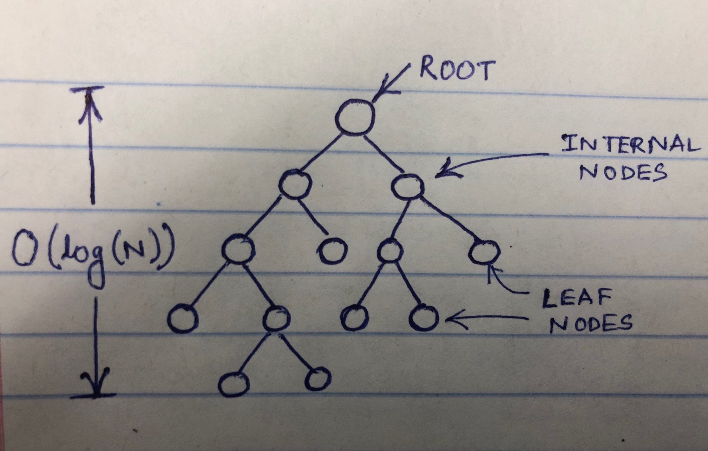
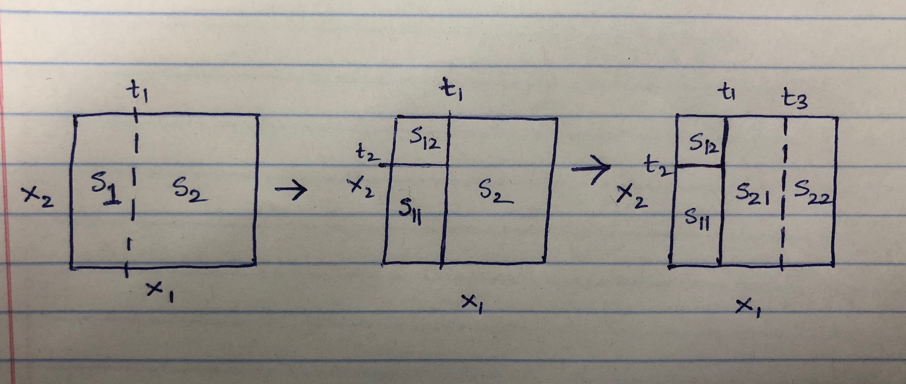

```{r setup, include=FALSE}
knitr::opts_chunk$set(echo = TRUE)
```

## Tree Based Models

#### What is a tree?

Tree is a very common and powerful data structure in Computer Science. If we use/construct the tree properly the 
operation time reduces to $O(log(N))$ where $N$ is the number of data points. Thus it becomes of interest in
Machine Learning as well since we almost always want the results to come immediately.

#### Umm! I did not quite understand how that works properly! How is it used in Machine Learning again?

Well as seen in the picture the height of a tree is of the order $log(N)$ and to answer a query we only need to 
traverse one branch and NOT all the branches, so literally if you are unlucky *(The Worst Case)* you have to
traverse the entire height .ie. of the order $log(N)$.

{width=50%}

Not only that trees are very easy to interpret and are not a black box. Simply make a single decision at every
node.

At every node we have to make a decision based on a particular feature's value. Essentially we have to divide our feature space based on the feature's value.
For example at the first node we make a decision that "okay, if the value of $X_1$ is less than $t_1$ we would go to the left else to the right."

Similarly at every node we do the same and when we have taken these decisions *recursively* we have our feature space divided into certain regions. Now we associate a particular class to the regions if it is a classification problem we are trying to solve OR a continuous value based on the mean/median/max/min etc depending on the problem statement if we are trying to solve a regression problem.

#### Cool! Wait what do we mean by recursive partitioning?

Basically what it means is that we always partition a subspace of the entire feature space and not the entire feature space at anytime( well except the first time). 

EXAMPLE: Let us take just two features $X_1$ and $X_2$ and we have the entire 2 dimentional feature space S. 



At first let us say we divide S into two sub spaces $S_1$ if $X_1 \le t_1 and S_2 otherwise$. 

Then recursively we partition $S_1$ into $S_11$ and $S_12$ if $X_2 \le t_2$ and $X_2 \gt t_2$ respectively. And lets say we divide $S_2$ into $S_21$ and $S_22$ based on $X_1 \le t_3$ or not. This process continues untill a *convergence criteria* is reached. So if I have to write a pseudo code then it would look like this:


    Partition(S, Features_Space)
    {
      if(Convergence criteria met)
        Stop Process
      
      Split_Feature = Select Feature from Feature_Space to divide S
    
      list(S_1, S_2, ... S_p) = Divide S into p sub-spaces based on Split_Feature
      
      Partition(S_1, Features_Space)
      Partition(S_2, Features_Space)
      ...Partition(S_p, Features_Space)
    }


#### I really don't understand how you are selecting one particular feature at every node to divide the subspace on? Also the splitting point?

Good question, I was coming to that. At every step we choose the *most informative feature*. The feature that provides us with the most amount of information about our task given what we already know. For example we might want to ask "Is it a living being?" before we are "Is it a male or a female?". *We select that feature and split which provides the maximum information gain* $IG$


#### Information Gain! What is that?

Before Information Gain understand what is homogenous node. A node is called Homogenous if it contains datapoints of only one class, otherwise the node is called Heterogenous or Impure.

Now Information Gain is measured as follows:

$$IG(D_{parent}, F) = I(D_{parent}) - \sum_i I(D_{child-i})$$

$D_{parent}=$ Parent Node

$D_{child-i}=$ ith Child Node

$F=Split Feature$

$I(D)=$ Impurity measure of node D.

We select the split that produces maximum Information Gain $IG(D)$.

<div style="background-color:#B8B8B8; text-align:justified; vertical-align: left; padding:40px 10px;">

Impurity measures are used to measure how impure a node is. If a node is homogenous the value of the impurity measure is 0. We have the following very commonly used impurity measures.

  - [Entropy](https://en.wikipedia.org/wiki/Entropy_(information_theory)): Entropy was first introduced by Claude
  Shannon to describe the impurity of a set of features. As the name suggests and as a very simplistic explaination of entropy it is the measure of disorder in the data. The entropy of a node will be highest if the probabilities of all classes in that node are equal (highest heterogenity). Will be 0 if a node contains data from only one class.
  
  
  $$Entropy(p) = -\sum_i p_i log_2(p_i)$$
$p_i:$ Probability of class i in that node.


A tree algorithm called ID3 uses Entropy as the impurity measure.


  - [Gini Impurity](https://en.wikipedia.org/wiki/Decision_tree_learning#Gini_impurity): Gini can be thought of as minimizing the probability of misclassification. Gini will also be 0 if node contains datapoints of only 1 class and maximum if node contains equal proportion of data from all classes.
  
  $$Gini = -\sum_i p_i * (1-p_i)$$

$p_i:$ Probability of class i in that node.

CART uses Gini for feature selection at every node.

  - [Misclassification]():
  
  $$Misclassification = 1 - max (p_i)$$

$p_i:$ Probability of class i in that node.

</div>


#### Okay let us look at an example!

In the figure the tuples (a, b) in each box/node signify that there are $a$ number of datapoints of class A and $b$ number of datapoints of class B. Lets look at the two splits on Feature-1 and on Feature-2:


  - Split on Feature 1: 
  
  $I(Child-1) = I(Child-2) = 0$ and $I(child-3)>0$
  
  - Split on Feature 2:
  
  $I(Child-1)>0,  I(Child-2)>0, I(child-3)>0$
  
  So $IG(D_{parent}, Feature-1) > IG(D_{parent}, Feature-2)$ So we the decision tree will pick Feature-1.
  
#### How do we get the decision out of the tree?

Well the result finding procedure is very simple. We only get the decision/prediction from the leaf nodes. 

For *regression* we simply find the average of the output variable and that is the prediction.

For *classification* we simply find the class with the maximum proportion in that particular leaf node.


#### That was simple. But how long should we grow the trees?

Well there are many techniques/approaches to handle pruning of trees. In case of trees the height of trees is the measure of their complexity.

One way is to simple stop early by either pre-deciding the maximum height or stop splitting if the Information Gain is less that a pre-set threshold. But this is not optimal since Trees use a Greedy approach so we never know that how much of an Information Gain we will acheive in the subsequent steps.

A very famous approach is to grow the tree as long as we can and then start pruning it by using *Cost-Complexity Pruning.* Now what Cost-Complexity pruning is will be covered in another article. For the time being you can study it from [here](https://onlinecourses.science.psu.edu/stat857/node/60).


##### Hope you learnt something and enjoyed it! Stay tuned for more articles!

